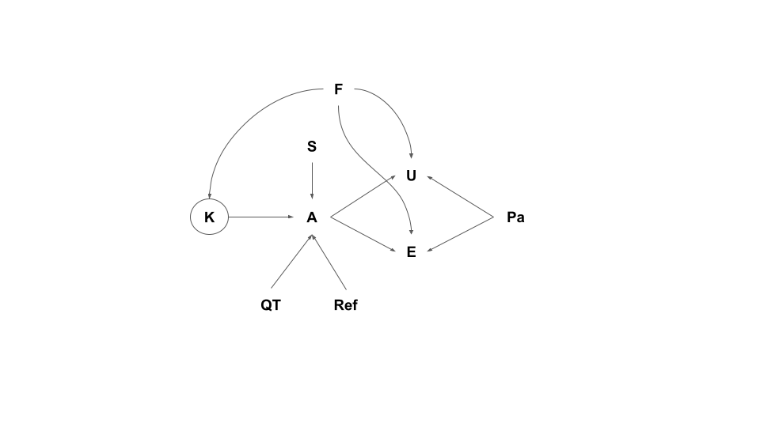

# PathGPT

## Aim

The aim of the study is to assess the ChatGPT reliability in addressing pathological problems/questions; in addition, as a secondary aim we want to determine the best way to “interrogate” ChatGPT.

## Study design

### Question design

We will write the prompts as clinico-pathological scenarios, imagining a pathologist using ChatGPT as an instrument to narrow down the differential diagnosis and solve the cases. We will identify several pathology subspecialties: 1) breast, 2) dermatopathology, 3) digestive tract pathology, 4) gyneco-pathology, 5) hemo-lympho-pathology, 6) male and urinary tract pathology, 7) neuroendocrine pathology, 8) neuropathology, 9) soft tissue pathology, 10) thoracic pathology. For each subspecialty, we will write 5 clinico-pathological scenarios. The scenarios will be written according to the most recent guidelines and reviewed by a pathologist expert in the subfield. Each scenario will be prompted to ChatGTP using the two following types of question: 1) open-ended (OE), and 2) multiple-choice (MC). In the open-ended questions, we will elicit the answer by asking “Which are the most likely differential diagnoses?”. In the multiple-choice questions, we will write 5 different differential diagnoses, imagining that the pathologist trying to narrow down the differentials might have some. The position of the correct answer will be randomized (see https://github.com/slrenne/PathGPT/blob/main/scripts/correct_DDX.r). Moreover, we will prompt the questions (OE or MC) either asking for references (R), using the following statement: “All the statements of the explanation shall be followed by a reference (author, year) taken from medical and scientific literature. Please also list all the references at the end of the document (author, year, source).” or not (NR). Finally, all the questions will be framed using the Persona Pattern prompting strategy (“From now on act as pathologist.”) and the Reflection Pattern (“When you provide an answer, please explain the reasoning and assumptions behind it.”) (White et al 2023). All questions will be reviewed by an English native speaker (DNC). A schematic representation of question design will be depicted in figure 1. All the questions will be uploaded in the study repository.

### Prompting
Each clinical scenario will be submitted to ChatGPT according to the four modalities described above: 1) OE-R, 2) OE-NR, 3) MC-R, and MC-NR. ChatGPT uses the whole history, up to 4,096 tokens, to prompt the answer, we will therefore submit each question in a new chat. The answers will be collected with a Google Form recording: 
1. the subspecialty; 
2. the question type (OE, MC);
3. reference asked (yes, no);
4. question text;
5. answer. 
All the answers will be found in the study repository.

### Evaluation
Each answer generated by ChatGPT will be assessed by an expert pathologist according to two evaluation criteria: 1) usefulness of the answer useful in supporting the clinico-pathological diagnosis (useful, not useful) and 2) absolute number (a count) of errors generated by ChatGPT (both in terms of generated notions and adequacy/reliability of the references provided by ChatGPT).  The order of ChatGPT answer was randomised and evaluated by the expert pathologists. The pathologist evaluation will be collected in a Google Form recording: 
1. pathologist name; 
2. usefulness (yes, no); 
3. total number of errors (integer); 
4. the errors (long answer text with the instruction to paste the error each in a new line).

### Model

Our estimand, the knowledge ($K$) of the ChatGPT is latent, to probe it we will elicit the answers ($A$) using a clinical scenario ($S$) combined with   modalities that differ by the question type ($QT$) and the asking of references ($Ref$). The answers will be evaluated by several pathologists ($Pa$), either assessing the usefulness ($U$) and the number of errors ($E$). We want to assess the $K$ specific to each subspecialty field $F$ ($K_F$); moreover, $F$ also contributes to the generation of the usefulness and the number of error count in the sense that somo pathologist might be more or less exper in each particular field ($Pa_f$).
